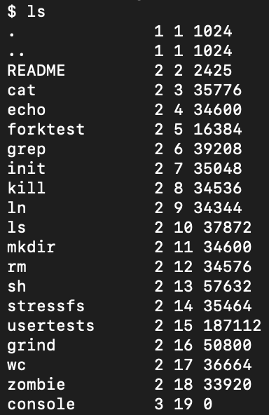
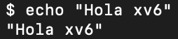
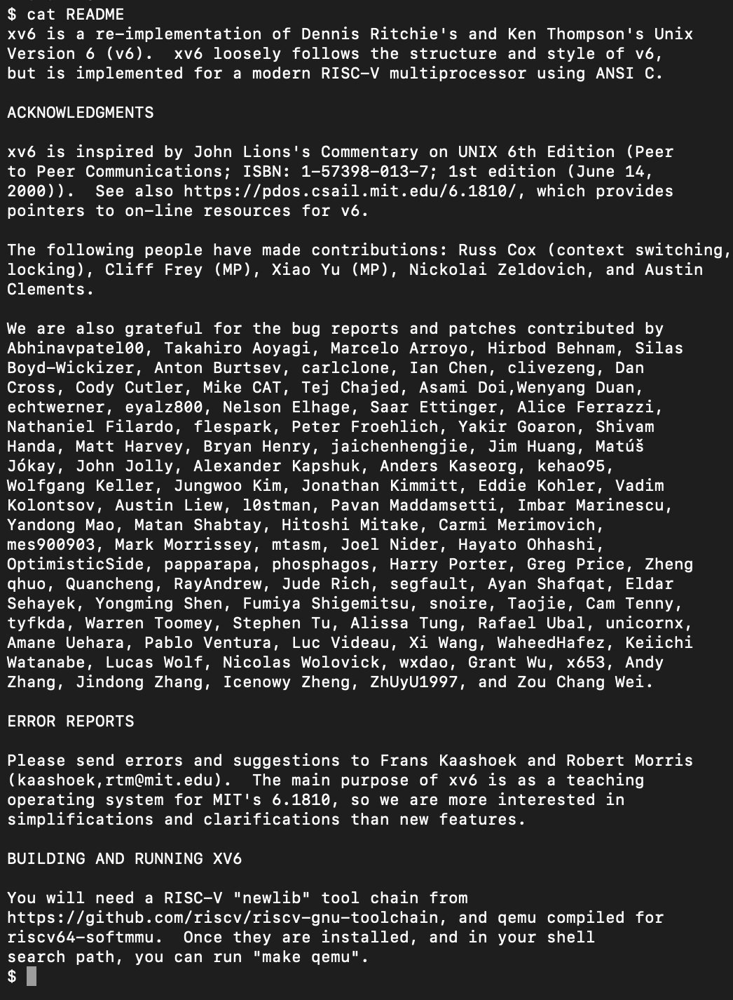

# INFORME — Tarea 0: Instalación y Ejecución de xv6 (RISC-V)

## Pasos seguidos
1. Se realizó un fork del repositorio oficial `mit-pdos/xv6-riscv` en GitHub, creando:  
   ->  https://github.com/antopcz/xv6-riscv
2. Se clonó el fork localmente:git clone https://github.com/antopcz/xv6-riscv.git
3. Se creó la rama de trabajo: git checkout -b antonia_zarate_t0
4. Se verificó la instalación de dependencias en macOS (QEMU y toolchain RISC-V).
5. Se compiló con `make` y se ejecutó con `make qemu`.
6. En xv6 se probaron los comandos:
- `ls`
- `echo "Hola xv6"`
- `cat README`

## Problemas encontrados y soluciones
- Error al clonar: ya existía carpeta `xv6-riscv`, se solucionó creando un nuevo fork limpio.  
- Error `exec git failed`: ocurrió porque se intentó usar git **dentro de xv6** en vez de la terminal macOS. Se corrigió cerrando QEMU y ejecutando git en la terminal.  

## Confirmación de funcionamiento
xv6 se ejecutó correctamente en QEMU y respondió a los comandos básicos solicitados.  

## Evidencia
Capturas de xv6 funcionando en QEMU:  

- `ls`:   
- `echo "Hola xv6"`:   
- `cat README`: 

